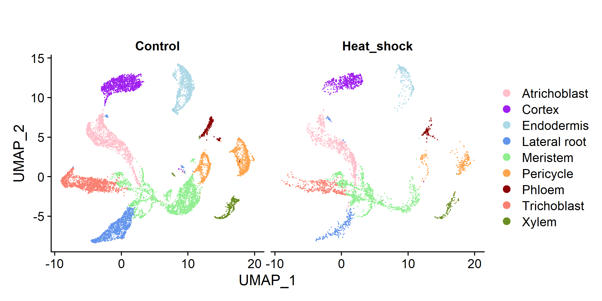
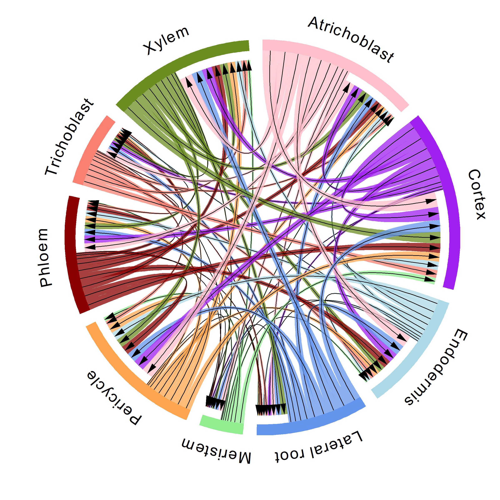
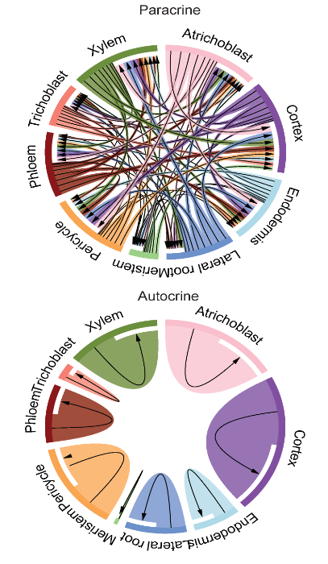
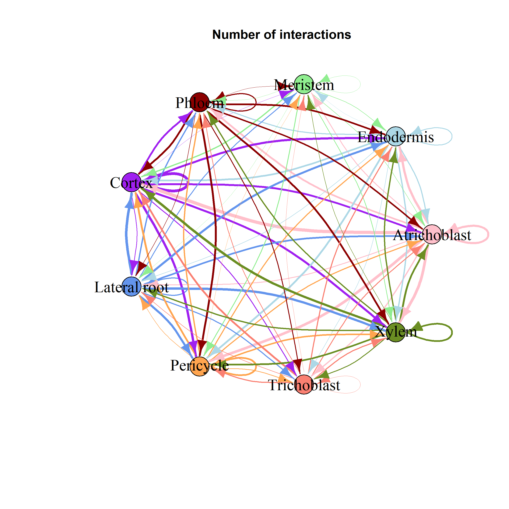
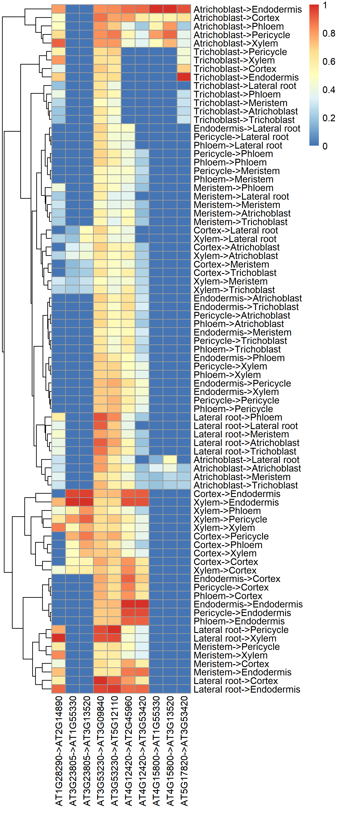

==========================
Explorer
==========================

A detailed exploration of the cell-cell communication for a given scRNA-seq dataset.

.. image:: _static/images/Explorer.png
        :width: 80%
        :align: center

Overview
------------------------
For example, to explore how cells communicate in plants under heat shock stress, the processed scRNA-seq dataset (GSE121619) was used as input of PlantPhoneDB, which contains 15,729 cells involving 9 cell types, namely Pericycle cells, Lateral root cells, Trichoblast cells, Cortex cells, Endodermis cells, Meristem cells, Phloem cells, Atrichoblast cells and Xylem cells.

      
The cell-cell communication network for the GSE121619 dataset using three different visualisations—circos plot, network graph, and heatmap.

chordDiagram
------------------------
PlantPhoneDB identified a total of 1,640 (including 853 experimental and 787 predicted ligand-receptor pairs) significant ligand-receptor pairs between pairwise cell types, including 1,457 paracrine ligand-receptor pairs and 183 autocrine ligand-receptor pairs.

		
network-graph
------------------------
Different number of interactions among different cell types could be visualized using network-graph view.

heatmap plot
------------------------
In particular, 49 significant ligand-receptor pairs were detected for communication of Atrichoblast and Cortex cells, which highlighted the importance of Atrichoblast-Cortex cell pair in response to heat-shock stress.

.. image:: _static/images/GSE121619_heatmap.png

dot plot
------------------------
In order to further explore the interaction relationships between cell types, we need to study the specific ligand-receptor interactions between different cell types and which ligand-receptor interactions are significantly enriched in the certain cell-cell pairs. 

.. image:: _static/images/GSE121619_dotplot.png
        :width: 100%
        :align: center      

The dot plot shows the average expression level and significance of ligand-receptor interactions across cell types.
     

Top 10 LR pairs
------------------------
Herein, we focused on top 10 ligand-receptor pairs ranked by score, which may play leading roles in cell-cell communication. Notably, some ligand-receptor pairs were detected in most of cell-cell pairs, such as AT3G53230-AT3G09840, AT3G53230-AT5G12110 and AT4G12420-AT2G45960, however, other ligand-receptor pairs were specific to cell-cell pairs, such as AT4G15800-AT1G55330 and AT4G15800-AT3G13520 are specific in Atrichoblast-Endodermis pair, implied different regulatory mechanisms of various ligand-receptor pairs. 

Pathway
------------------------
We constructed an internal signaling network regulated by each ligand-receptor pair for Atrichoblast-Cortex cell pair. Pathway analysis result showed that AT1G28290-AT2G14890 pair (FDR = 3.77×10-64) was mainly involved in ribosome pathway (ath03010). 

.. image:: _static/images/GSE121619_Pathway.png
      
Intriguingly, previous study supported that heat stress would give rise in ribosome pausing phenomenon in `Arabidopsis thaliana` (Merret et al., 2015).

.. image:: _static/images/ribosome.png
        :align: center 

