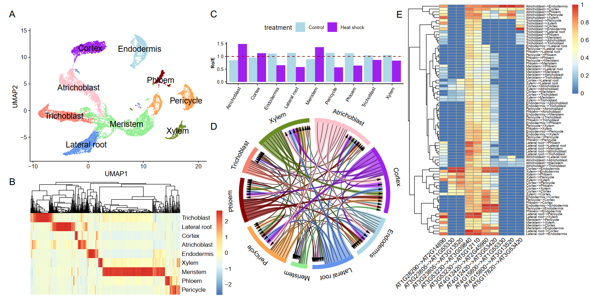

==========================
Case Studies
==========================

Case 1. Significant cell-cell interactions of Heat-Shocked Root Cells in Arabidopsis thaliana
---------------------------------------------------------------------------------------------

Case 2. Compare the number of interactions among cell types between two datasets (93-11 and Nipponbare)
-------------------------------------------------------------------------------------------------------

.. image:: _static/images/case2.png
        :width: 80%
        :align: center