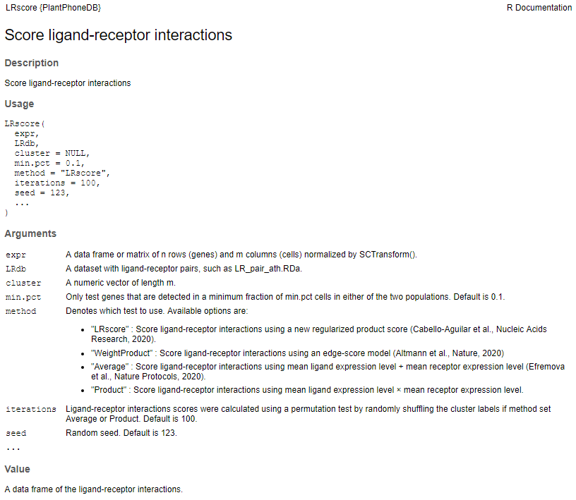
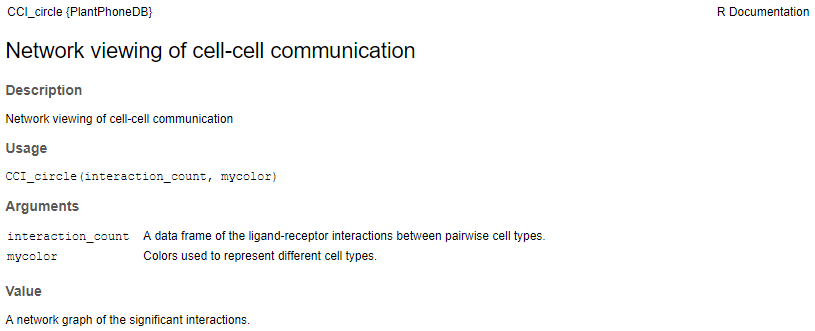

==========================
Software
==========================

PlantPhoneDB installation
--------------------------
**PlantPhoneDB** requires R v4.0.2 or greater.
 
To install it, the easiest way is to use the `R` package `devtools` and its function `install_github`. If you don't have all the dependancies needed to use PlantPhoneDB package, run the commands below::

    install.packages(c("devtools", "Seurat", "tidyverse", "ggplot2", "ggsci", "pheatmap", "ggpubr", "RColorBrewer", "patchwork", "lsa", "viridis", "hrbrthemes", "circlize", "chorddiag", "ggplotify", "data.table", "parmigene", "infotheo", "igraph", "cowplot", "grid", "dplyr")) ##Installs devtools and the PlantPhoneDB CRAN dependancies
    
Then you just have to load `devtools` package and run the command below::

    library(devtools)
    install_github("Jasonxu0109/PlantPhoneDB")

Once all the dependencies are downloaded and loaded, you can load the "PlantPhoneDB" package. 

-------------------------- 

PlantPhoneDB provides some functions using R (version: 4.0.2), such as LRscore, heatmap_count, CCI_circle, CCI_network and LR_pathway, to infer and construct cell-cell communication network and intracellular signaling pathway.

**LRscore**

**CCI_circle**

**CCI_network**

.. image:: _static/images/CCI_network.png

**heatmap_count**

.. image:: _static/images/heatmap_count.png

**LR_pathway**

.. image:: _static/images/LR_pathway.png

-------------------------- 

Ligand-receptor pairs
--------------------------

**Ligand**

We searched secreted proteins from the `UniProtKB/Swiss-Prot <https://www.uniprot.org/>`_ database using the keyword KW-0964.

**Receptor**

We searched plasma membrane proteins from the `UniProtKB/Swiss-Prot <https://www.uniprot.org/>`_ database using the keyword KW-1003.

For example: keyword:"Cell membrane [KW-1003]" AND reviewed:yes AND organism:"Arabidopsis thaliana (Mouse-ear cress) [3702]"

**Interaction Data**

The set of protein interactions were obtained from:

1. `BioGRID Version 4.4.199 Released <https://thebiogrid.org/>`_: The BioGRID's curated set of data have been updated to include interactions, chemical associations, and post-translational modifications (PTM) from 77,459 publications. For `Arabidopsis thalianain`, we extracted protein-protein interactions as below::

    url: https://downloads.thebiogrid.org/BioGRID/Release-Archive/BIOGRID-4.4.199/
    grep 'taxid:3702' BIOGRID-ALL-4.4.199.mitab.txt >PPI_arth.BIOGRID
    awk -F"[: \t]" '/taxid:3702/{print $3,$6}' BIOGRID-ALL-4.4.199.mitab.txt >PPI_arth.BIOGRID

2. `Interactome2.0 <https://www.arabidopsis.org/download/index.jsp>`_: The TairProteinInteraction is a tab-delimited file containing protein-protein interaction annotations for Arabidopsis genes made by TAIR and BIOGRID. Currently all the annotations in this file are extracted from the literature.

3. `IntAct <https://www.ebi.ac.uk/intact/>`_: IntAct provides a free, open source database system and analysis tools for molecular interaction data. All interactions are derived from literature curation or direct user submissions. For `Arabidopsis thalianain`, we extracted protein-protein interactions as below::

    url: ftp://ftp.ebi.ac.uk/pub/databases/intact/current
    intact.zip: entire contents of the database in a single file
    grep 'taxid:3702(arath)' intact.txt >intact_arth.txt
	
4. `plant.MAP <http://plants.proteincomplexes.org/>`_: This website provides access to protein complexes and stable protein interactions from A pan-plant protein complex map reveals deep conservation and alternate assemblies. Please note: CF-MS scores > 0.5 correspond to ~90% true positive rate; scores > 0.2 correspond to ~50% true positive rate. We kept PPIs if scores > 0.3, data obtained as below::

    url: http://plants.proteincomplexes.org/download
    complete_orthogroup_protID_mapping.csv # Translation Table (contains additional mappings used for web site queries)
    allplants_cfms_scores_annot.txt # All scored pairwise protein-protein interactions with CF-MS scores (3,076,999 unique pairwise interactions)

5. `STRING v11 <https://cn.string-db.org/>`_: protein-protein association networks with increased coverage, supporting functional discovery in genome-wide experimental datasets. In STRING, we chose PPIs if combined score > 600. The combined score is computed by combining the probabilities from the different evidence channels and corrected for the probability of randomly observing an interaction. Data obtained as below::

    url: https://cn.string-db.org/cgi/download
    3702.protein.links.v11.0.txt.gz
	
6. `PubMed <https://pubmed.ncbi.nlm.nih.gov/>`_: comprises more than 33 million citations for biomedical literature from MEDLINE, life science journals, and online books. We searched and manually reviewed ligand-receptor pairs with the term 'ligand and receptor' in the title or abstract in PubMed by text mining.
	
7. orthologs of human gene: PlantPhoneDB integrates some existing resources (CellTalkDB (Shao `et al`., 2021), SingleCellSignalR and CSOmap (Ren `et al`., 2020)) that contain human ligand-receptor interactions. We did orthologs assignment between Homo sapiens and `Arabidopsis thaliana` proteomes using the InParanoid algorithm (Sonnhammer and Östlund, 2015) to transfer annotations of known PPI.

-------------------------- 

**Computational identification**

We developed a workflow to perform computational identification of secreted proteins, receptor-like kinases (RLKs) or receptor-like proteins (RLPs) and their interaction based on protein sequences.

.. image:: _static/images/FigureS2B.png

Firstly, the signalP 5.0 software was used for secretory signal peptide prediction. The accuracy of secretome prediction could be further improved by combing signalP 5.0 with other software, including Phobius, TMHMM and TargetP, etc. Therefore, a predicted protein that have a secretory signal peptide by at least three software, included signalP 5.0 and TMHMM.
Then, Restrepo-Montoya `et al`. developed a workflow for computational identification of RLK/RLP and their structural domains in legumes. The computational approach is well supported and can be applied on the proteomes of other plant species.
Lastly, computational prediction of protein-protein interaction using CAMP, a sequence-based deep learning framework for multifaceted prediction of peptide-protein interactions.

